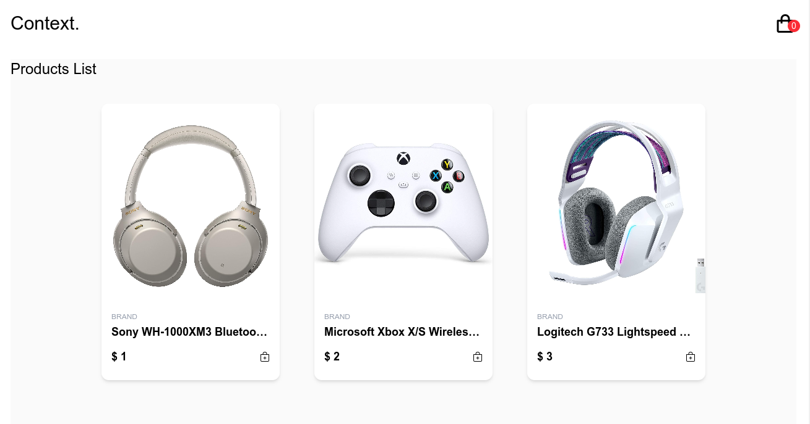

# Shopping-cart

## Description

An e-commerce store, imitating a tech store, built with React. Includes dedicated product page and cart page managed by reactr-router-dom and useContext for passing complex state.

live demo [here]

## Showcase

## Objectives & Outcomes

The main motivation for this work was:

* to manage complex state with the Context API

* to Fetch data from an API

* to style the application using A CSS framework (Tailwindcss)

* to design and deploy a multiple page application using react router.

## Technologies

* Reactjs
* Tailwindcss
* Eslinter
* react-icons